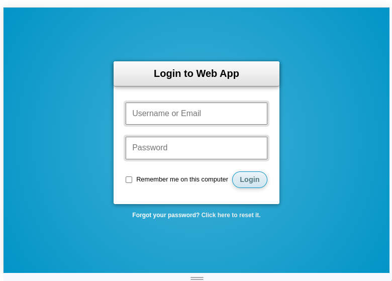
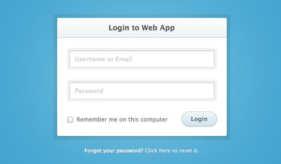

# Frontend bootcamp Day 02

## Table of Contents

- [Frontend bootcamp Day 02](#frontend-bootcamp-day-02)
  - [Table of Contents](#table-of-contents)
  - [Screenshots](#screenshots)
  - [Tasks](#tasks)
    - [Exercise 1. Basic HTML index.html](#exercise-1-basic-html-indexhtml)
    - [Exercise 2. Basic CSS index.html](#exercise-2-basic-css-indexhtml)
  - [Project status](#project-status)
  - [Contacts](#contacts)

## Screenshots

> ex1
>
> ex2

## Tasks

### Exercise 1. Basic HTML [index.html](./src/chapter_1/index.html)

This is a real test task for a novice layoutor.This [PDF-document](./materials/html-junior.pdf) Translate a page into html. CSS does not need to be used. All logical elements are highlighted with semantically correct tags. Links should be - links (`<a>`), lists - lists (`<ul>`, `<ol>`) and so on;
Use headlines in accordance with their level (`<h1>..<h6>`).

### Exercise 2. Basic CSS [index.html](./src/chapter_2/index.html)

You need to make a layout of the login form :

You can choose the colors at your own discretion, the main thing is that the composition of the layout is not violated.

## Project status

Project is: **completed**

## Contacts

Created by [@sashauly](https://t.me/sashauly) - feel free to contact me!
