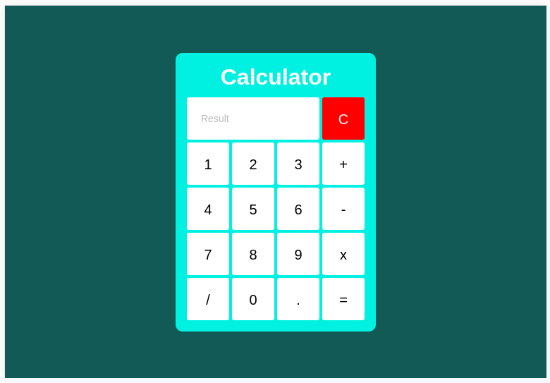
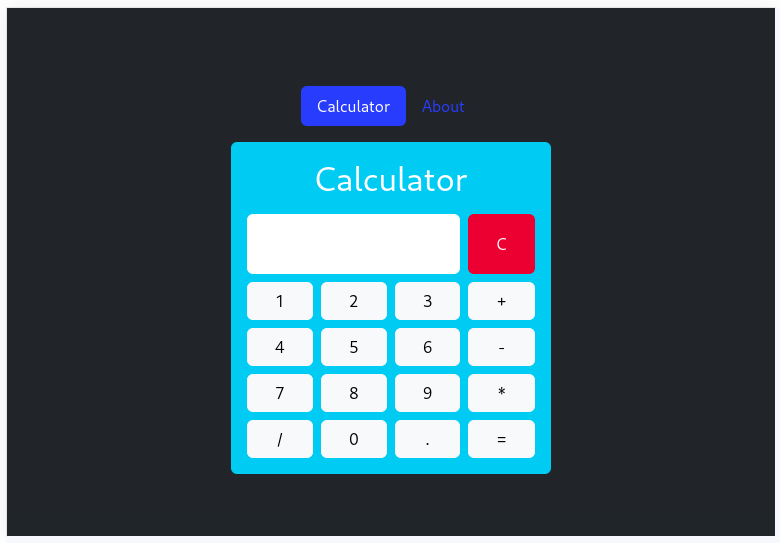
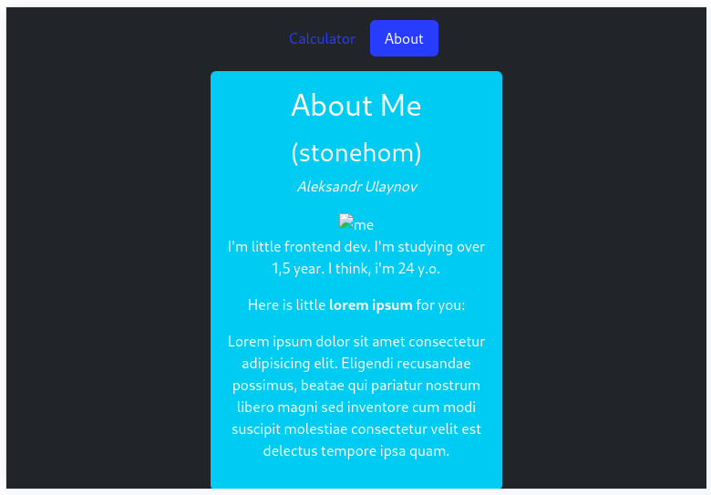

# Frontend bootcamp Day 03

Introduction to CSS Grid, JS in HTML and Bootstrap.

## Table of Contents

- [Frontend bootcamp Day 03](#frontend-bootcamp-day-03)
  - [Table of Contents](#table-of-contents)
  - [Screenshots](#screenshots)
  - [Tasks](#tasks)
    - [Exercise 1. CSS Grid Layout index.html](#exercise-1-css-grid-layout-indexhtml)
    - [Exercise 2. JS Calculator index.html](#exercise-2-js-calculator-indexhtml)
    - [Exercise 3. CSS Framework Bootstrap index.html](#exercise-3-css-framework-bootstrap-indexhtml)
  - [Project status](#project-status)
  - [Contacts](#contacts)

## Screenshots

> ex1
>
> ex3

## Tasks

### Exercise 1. CSS Grid Layout [index.html](./src/chapter_1/index.html)

You need to flash a calculator using the CSS Grid Layout module.You should get the following result:

### Exercise 2. JS Calculator [index.html](./src/chapter_2/ex2/index.html)

Great, you have a HTML form of your calculator!Now you need to implement the functionality of his work.Write a script that implements all the operations presented in the layout:

> - addition
> - subtraction
> - multiplication
> - division
> - erase everything

### Exercise 3. CSS Framework Bootstrap [index.html](./src/chapter_2/ex3/index.html)

You have studied the work with the CSS Framework Bootstrap.
Now you need to improve your calculator page
Add Header on a page where there will be 2 links:

- on the Calculator page, where your calculator will be
- to the Student Info page
  On the Student Info page, your photo and information about you should be displayed:
- Name
- training experience
- Age.

## Project status

Project is: **completed**

## Contacts

Created by [@sashauly](https://t.me/sashauly) - feel free to contact me!
