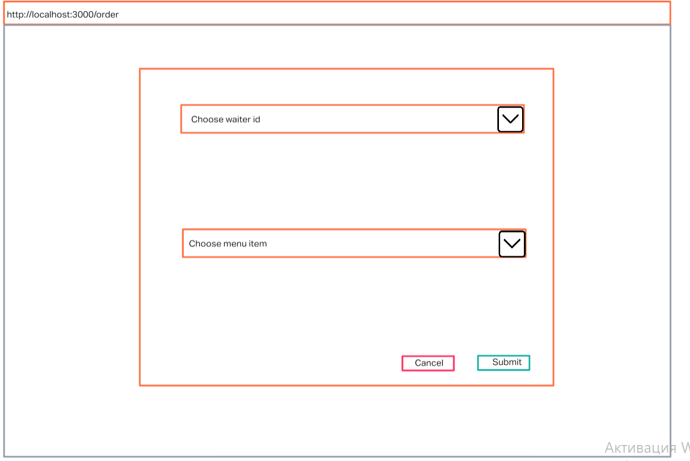
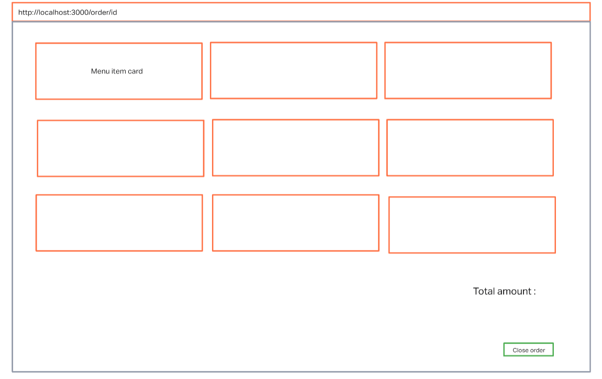
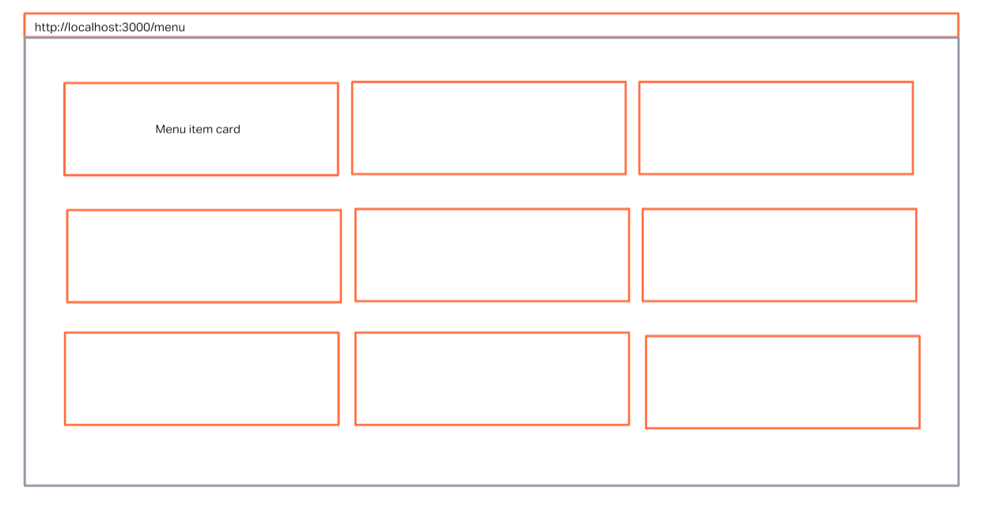
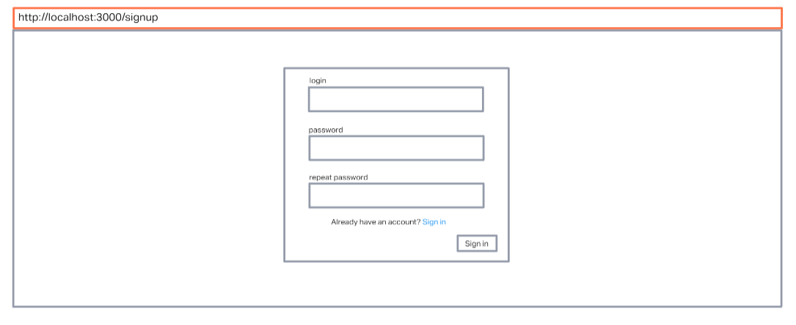
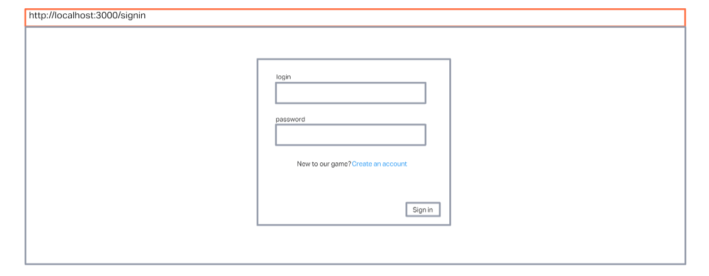

# Frontend bootcamp Day 05

## Table of Contents

- [Frontend bootcamp Day 05](#frontend-bootcamp-day-05)
  - [Table of Contents](#table-of-contents)
  - [Screenshot](#screenshot)
  - [Description](#description)
  - [Technologies](#technologies)
  - [Setup](#setup)
  - [Tasks](#tasks)
    - [Exercise 1](#exercise-1)
      - [Main page](#main-page)
      - [Orders page](#orders-page)
      - [Single Order page](#single-order-page)
      - [Menu page](#menu-page)
    - [Exercise 2](#exercise-2)
      - [Registration page](#registration-page)
      - [Authorization Page](#authorization-page)
  - [Project status](#project-status)
  - [Contacts](#contacts)

## Screenshot

## Description

Today we will look at what the HTML `templateers` are and what are the advantages of their use. We will learn how to send requests for the server from the client. We learn about `Cookies` and how to work with `sessions` in `Express`.

## Technologies

- [JavaScript](https://developer.mozilla.org/en-US/docs/Web/JavaScript)
- [Sequelize](https://sequelize.org/)
- [Sequelize - CLI](https://sequelize.org/master/manual/cli.html)
- [PostgreSQL](https://www.postgresql.org/)
- [Node.js](https://nodejs.org/en/)
- [Express](https://expressjs.com/)
- [REST API](https://en.wikipedia.org/wiki/Representational_state_transfer)
- [Handlebars](https://handlebarsjs.com/)
- [express-session](https://www.npmjs.com/package/express-session)

## Setup

There are 2 parts in this project: first one in `chapter_1` with basic layout and second one in `chapter_2` with authorization and cookies.

- `npm i`
- Setup your postgres config in [src/config/config.json](./src/config/config.json)
- `npm run dbr`

> To run first one in `chapter_1`: `npm run start_v1`
>
> To run second one in `chapter_2`: `npm run start_v2`

## Tasks

### Exercise 1

You already have a service for a restaurant, let's make UI an idea for it.

There should be `4` pages in the application:

#### Main page

(<http://localhost:3000/>)

The user sees an Input for entering an employee ID (waiter)
After entering the page, a list of all orders with which this employee worked appears

#### Orders page

(<http://localhost:3000/orders>)

The user sees a simple form that consistent of 2 selectors.In the first select, you need to choose a waiter, in the second to form an order from the presented dishes
In case of successful sending data from the user's shape, it redirects to the order page, otherwise there is a message with the text of the error

#### Single Order page

(<http://localhost:3000/orders/id>)

On this page, the user sees all the information about the order (the order ID can be obtained from URI).In tabular form, dishes from the order (along with the pictures) are listed, at the bottom of the page the current order cost is indicated and the ‘close order’ button ‘

#### Menu page

(<http://localhost:3000/menu>)

On the current page in tabular form, all dishes from the menu, with pictures, information from the description and the number of calories in the dish are listed

### Exercise 2

You almost finished your application!The rest is to make it a little more believable. The `User` model in the database must be expanded and added with `username` and `password`.Add two more pages to your application.On these pages, the form of registration/authorization of the user will be displayed.The user can register as a waiter, or as admin. Different pages will be available on the type of user in the application.

#### Registration page

(<http://localhost:3000/signup>)

#### Authorization Page

(<http://localhost:3000/signin>)

> `Waiter`:
>
> - `/` - sees the current order, or a message with the call to go to work more actively.
> - `/orders` - The waiter sees the form for creating a new order.The form consists of Invuting and a selective.Input is casualized and the name of the waiter is introduced in it.In the selector, you can choose dishes for order
> - `/menu` - this page is available to all types of user

> `Admin`:
>
> - `/` - on the main page, Admin sees cards of all current orders with information about the composition of the order and the waiter that serves it.
> - `/orders` - Admin cannot create an order

## Project status

Project is: **completed**

## Contacts

Created by [@sashauly](https://t.me/sashauly) - feel free to contact me!
